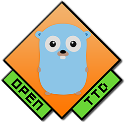

 [](https://pkg.go.dev/mod/github.com/ropenttd/gopenttd)

**gopenttd** is a simple Golang library for querying OpenTTD game servers.

## Command Line Usage

There's a command line utility called [_openttd\_scrape_](cmd/openttd_scrape) which produces nice JSON objects for you to parse externally. See the documentation there for more information.

You can run it with something like the following:
```
go get github.com/ropenttd/gopenttd
go run github.com/ropenttd/gopenttd/cmd/openttd_scrape
```

## API

**This library is under heavy development, and is not in the slightest bit stable. Things will change and will drastically break your code, I guarantee it.**

There are three packages:
* `util`, which has numerous helper functions and constants for things like colours
* `query`, which utilizes OpenTTD's UDP-based polling game query protocol to glean basic information about a server without a password
* `admin`, which uses OpenTTD's TCP based protocol with significantly more capability, but requires that you have the admin password for the server you are connecting to (You probably want this one if you're building a bot)

**These are likely to be merged into one package in the medium term.**

Please see the [godoc](https://pkg.go.dev/github.com/ropenttd/gopenttd/pkg) for further information on all of these packages.

### Client Protocol

Here's a brief example:
```go
package main

import (
	"github.com/ropenttd/gopenttd/pkg/query"
	"encoding/json"
	"fmt"
)


func main() {
	result, err := query.ScanServer("s1.ttdredd.it", 3979)
	if err != nil {
        panic(err)
    }
	var b []byte
    b, err = json.MarshalIndent(result, "", "    ")
    if err != nil {
        panic(err)
    }
    fmt.Println(string(b))
}
```

Please see the [godoc](https://pkg.go.dev/github.com/ropenttd/gopenttd/pkg/query) for further information.

### Admin Protocol

The Admin Protocol is a connection based protocol that you communicate to using a combination of a Write command and a channel reader for responses.

The API here is pretty much a clone of [discordgo](https://github.com/bwmarrin/discordgo), so if you've ever used that, you'll feel right at home here.
```go
package main

import "github.com/ropenttd/gopenttd/pkg/admin"

func main() {
	sess, err := admin.New("s1.ttdredd.it", 3977, "password")
    if err != nil {
    	panic(err)
    }
    err = sess.Open()
    if err != nil {
    	panic(err)
    }
}

```

Please see the [godoc](https://pkg.go.dev/github.com/ropenttd/gopenttd/pkg/admin) for help using the rest of the Admin API.

## Credit / Licensing

_gopenttd_ is licensed under the [MIT license](LICENSE).

_gopenttd_ is heavily based on [discordgo](https://github.com/bwmarrin/discordgo), which is licensed under the BSD license.
